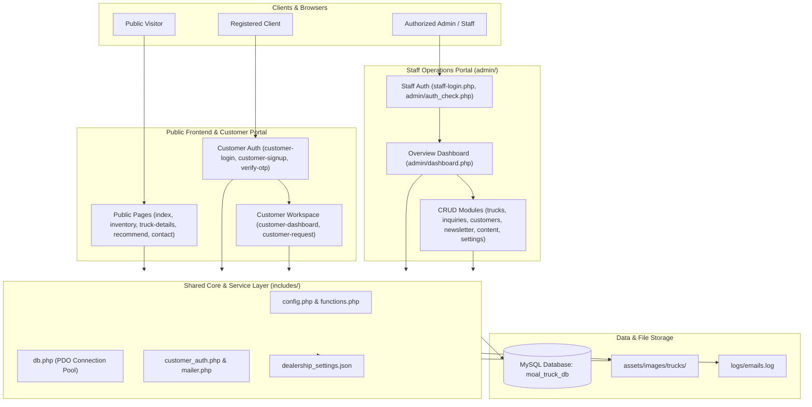
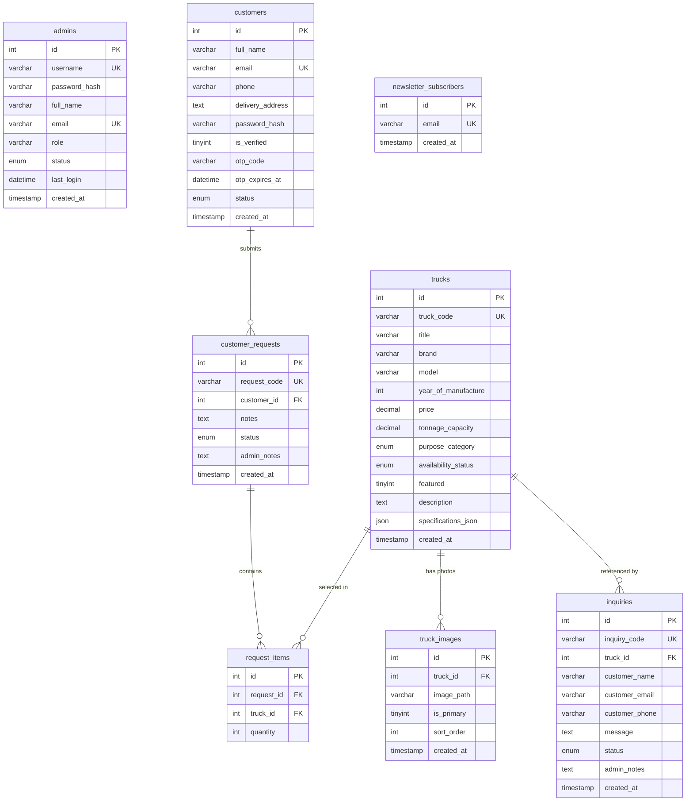

# Moal General Suppliers — Codebase & System Architecture Overview

> **Context Document for AI Coding Agents & Developers**  
> **Repository Root**: `C:\laragon\www\moal-truck-inventory\`  
> **Base URL**: `http://localhost/moal-truck-inventory/`  
> **Admin Portal**: `http://localhost/moal-truck-inventory/admin/`  
> **Last Updated**: 2026-09-25

---

## 1. Project Purpose & Scope

### 1.1 What This Software Does
**Moal General Suppliers** is a production-grade commercial truck dealership and fleet sourcing web application tailored for the Nigerian commercial transport, logistics, mining, construction, and haulage market.

### 1.2 Who It's For
1. **Commercial Fleet Buyers & Logistics Operators**: Fleet managers, corporate logistics directors, haulage contractors, and individual buyers searching for heavy-duty commercial vehicles (Tippers, Prime Movers, Fuel Tankers, Flatbeds, Concrete Mixers) with certified customs clearance, transparent pricing in Nigerian Naira (`₦`), and inquiry workflows.
2. **Dealership Operations & Sales Staff**: Sales consultants and administrators managing vehicle stock, tracking quotation leads, responding to client inquiries, overseeing customer profiles, and updating dealership contact details.

### 1.3 Core Value Proposition
- **Dynamic Heavy-Duty Catalog**: Filterable by purpose category (*Heavy Haulage*, *Construction & Mining*, *Distribution & Logistics*, *Agriculture & Farming*, *Specialized Transport*), brand (HOWO, Mercedes-Benz, Mack, Scania, MAN, Shacman), payload tonnage capacity, price, and foreign-used/brand-new condition.
- **Client Authentication & Sourcing Workflow**: Self-service registration with real 6-digit Email OTP verification, customer quotation tracking, and custom sourcing requests.
- **Streamlined Staff Operations Portal**: Clean, modern, data-driven back-office operations suite with collapsible sidebar (`<` / `>`), real-time stock status management, inquiry review ledger, and time-series analytics powered 100% by MySQL database queries (0 hardcoded fake numbers).

---

## 2. Architecture Overview

### 2.1 High-Level Architecture
The project follows a clean, modular MVC-inspired monolithic PHP architecture with clear separation between the public storefront, customer portal, and authenticated staff management portal.



### 2.2 Request Lifecycle & Data Flow
1. **Public Browsing**: Request enters `index.php` or `inventory.php` $\to$ loads `includes/config.php` and `includes/db.php` $\to$ queries `trucks` table $\to$ renders server-side HTML through `includes/header.php` and `includes/footer.php`.
2. **Customer Lead Submission**: Buyer submits inquiry from `truck-details.php` or `inquiry.php` $\to$ validates CSRF token $\to$ generates unique tracking code (`INQ-2026-XXXXXX` or `INQ-000X`) $\to$ inserts into `inquiries` table $\to$ notifies staff via dashboard unread bell counter.
3. **Customer OTP Verification**: User signs up at `customer-signup.php` $\to$ hashes password with `PASSWORD_BCRYPT` $\to$ generates 6-digit OTP $\to$ stores hashed OTP with 15-minute expiration $\to$ delivers OTP via `includes/mailer.php` (writes to `logs/emails.log` in local dev or sends via SMTP) $\to$ user enters OTP at `verify-otp.php` $\to$ account marked `is_verified = 1`.
4. **Staff Management**: Staff authenticates at `staff-login.php` $\to$ verifies bcrypt hash $\to$ initiates authenticated session $\to$ redirects to `admin/dashboard.php` $\to$ performs inventory CRUD, updates inquiry statuses (`Pending` $\to$ `In Review` $\to$ `Resolved`), and logs staff response notes.

---

## 3. Tech Stack

| Layer | Technology | Version / Spec | Justification |
| :--- | :--- | :--- | :--- |
| **Backend Language** | PHP | 8.3+ (Strict Types, PDO) | Native performance, ubiquitous hosting support, clean monolithic architecture. |
| **Database** | MySQL / MariaDB | 8.0+ / 10.4+ | Relational schema integrity, foreign keys (`CASCADE`/`SET NULL`), JSON field support. |
| **Database Access** | PHP PDO | Prepared Statements | Full protection against SQL injection; connection pooling via `getDB()`. |
| **Frontend Layout** | Vanilla HTML5 / CSS3 / ES6 | Custom SaaS Design System | Zero heavy framework dependencies, instant load times, clean responsive grids. |
| **Data Visualization** | Chart.js | 4.4+ (via CDN) | Lightweight, responsive canvas rendering for lead timeline and inventory status donuts. |
| **Email Delivery** | Custom Mailer + PHPMailer | Multi-Transport | File fallback logging (`logs/emails.log`) for offline dev; SMTP-ready for production. |
| **Web Server / Env** | Apache (Laragon Suite) | Windows OS | Standardized local development environment mapped to `http://localhost/moal-truck-inventory/`. |

---

## 4. Directory & File Structure

```
C:\laragon\www\moal-truck-inventory\
├── admin\                              # Staff & Dealership Management Portal
│   ├── assets\                         # Admin-specific stylesheets and scripts
│   │   └── css\admin.css               # Main administrative stylesheet (Clean SaaS design system)
│   ├── includes\                       # Administrative layouts and shell partials
│   │   ├── header.php                  # Sidebar navigation, topbar search & notification bell
│   │   └── footer.php                  # Footer & JS controllers (sidebar collapse, dropdowns)
│   ├── auth_check.php                  # Middleware enforcing active staff session
│   ├── activities.php                  # System-wide activities & audit stream with filters
│   ├── content.php                     # Website content & dealership settings editor
│   ├── customer-details.php            # Detailed customer dossier & inquiry history
│   ├── customers.php                   # Client Information accounts directory
│   ├── dashboard.php                   # Overview dashboard (pure widget & chart layout)
│   ├── index.php                       # Redirect router to dashboard.php
│   ├── inquiries.php                   # Customer inquiries ledger, filters & CSV export
│   ├── inquiry-details.php             # Inquiry review, status updater & staff response form
│   ├── login.php / logout.php          # Administrative session handlers
│   ├── newsletter.php                  # Newsletter subscriber list & CSV exporter
│   ├── reports.php                     # Operations reports with print layout & CSV export
│   ├── requests.php / request-details.php # Custom fleet sourcing requests
│   ├── settings.php / profile.php      # Staff credentials & password security management
│   ├── truck-delete.php                # Safe truck deletion handler
│   ├── truck-form.php                  # Create/Edit truck inventory form with image upload
│   └── trucks.php                      # Available commercial vehicle inventory list with filters
│
├── assets\                             # Global static assets
│   ├── css\style.css                   # Public storefront design system stylesheet
│   └── images\                         # Image assets
│       ├── branding\                   # Dealership logos and hero truck backgrounds
│       └── trucks\                     # Uploaded vehicle photos and catalog galleries
│
├── database\                           # Database definition and seed files
│   ├── schema.sql                      # Complete DDL table structure
│   └── seed_data.sql                   # Realistic Nigerian truck inventory & customer seed data
│
├── includes\                           # Shared backend core components
│   ├── config.php                      # Application constants, DB credentials, contact details
│   ├── customer_auth.php               # Customer auth guards & session utilities
│   ├── db.php                          # Singleton PDO database connector (`getDB()`)
│   ├── dealership_settings.json        # Dynamic content overrides (hotline, address, headlines)
│   ├── footer.php                      # Public storefront footer & mobile navigation
│   ├── functions.php                   # Sanitization, formatting, CSRF tokens & flash messages
│   ├── header.php                      # Public storefront header & clean minimal navigation
│   └── mailer.php                      # Dual-mode transactional email transport & logger
│
├── logs\                               # Application logs
│   └── emails.log                      # Captured outgoing emails/OTPs for local testing
│
├── about.php                           # Company profile, heritage & yard locations
├── contact.php                         # Contact form & dealership yard map
├── customer-dashboard.php              # Customer portal workspace (inquiries & fleet requests)
├── customer-login.php                  # Customer login form with password eye toggles
├── customer-logout.php                 # Customer session termination
├── customer-request.php                # Custom fleet sourcing request submission form
├── customer-signup.php                 # Customer registration with validation
├── forgot-password.php                 # Customer password reset request form
├── index.php                           # Homepage (Hero, certified inventory, recommendation CTA)
├── inquiry.php                         # General vehicle inquiry submission endpoint
├── inventory.php                       # Commercial vehicle catalog with filters & sorting
├── newsletter.php                      # Public newsletter subscription endpoint
├── recommend.php                       # Interactive 3-step Truck Recommendation Assistant
├── reset-password.php                  # Token-verified password reset form
├── services.php / why-choose-us.php    # Value proposition & logistics services pages
├── staff-login.php                     # Authorized staff authentication page
├── truck-details.php                   # Comprehensive vehicle specification dossier & inquiry modal
├── verify-email.php                    # Email link verification handler
└── verify-otp.php                      # 6-digit OTP verification interface
```

---

## 5. Key Entry Points

### 5.1 Public Storefront
- **Homepage**: [`index.php`](file:///C:/laragon/www/moal-truck-inventory/index.php) — Showcase hero section, featured inventory, category filters, and recommendation assistant teaser.
- **Inventory Catalog**: [`inventory.php`](file:///C:/laragon/www/moal-truck-inventory/inventory.php) — Full vehicle browsing with live search, category, tonnage, brand, and sorting parameters.
- **Truck Dossier**: [`truck-details.php?id=...`](file:///C:/laragon/www/moal-truck-inventory/truck-details.php) — Complete technical specifications, photos, and direct quotation modal.
- **Truck Recommendation Engine**: [`recommend.php`](file:///C:/laragon/www/moal-truck-inventory/recommend.php) — 3-step decision tree matching tonnage, terrain, and budget to catalog trucks.

### 5.2 Customer Portal & Auth
- **Sign In**: [`customer-login.php`](file:///C:/laragon/www/moal-truck-inventory/customer-login.php)
- **Sign Up**: [`customer-signup.php`](file:///C:/laragon/www/moal-truck-inventory/customer-signup.php)
- **OTP Verification**: [`verify-otp.php`](file:///C:/laragon/www/moal-truck-inventory/verify-otp.php)
- **Client Workspace**: [`customer-dashboard.php`](file:///C:/laragon/www/moal-truck-inventory/customer-dashboard.php) — Displays active inquiries, assigned tracking codes, staff responses, and fleet requests.

### 5.3 Staff Portal & Administration
- **Staff Login**: [`staff-login.php`](file:///C:/laragon/www/moal-truck-inventory/staff-login.php)
- **Overview Dashboard**: [`admin/dashboard.php`](file:///C:/laragon/www/moal-truck-inventory/admin/dashboard.php) — Executive overview, time-based greetings, real date filters, 6 KPI cards, 2 Chart.js analytics charts, and recent activity queues.
- **Inventory Management**: [`admin/trucks.php`](file:///C:/laragon/www/moal-truck-inventory/admin/trucks.php) & [`admin/truck-form.php`](file:///C:/laragon/www/moal-truck-inventory/admin/truck-form.php)
- **Inquiries Ledger**: [`admin/inquiries.php`](file:///C:/laragon/www/moal-truck-inventory/admin/inquiries.php) & [`admin/inquiry-details.php`](file:///C:/laragon/www/moal-truck-inventory/admin/inquiry-details.php)

---

## 6. Data Models & Database Schemas

All tables reside in MySQL database **`moal_truck_db`** (InnoDB, `utf8mb4_unicode_ci`):



### Table Details
1. **`admins`**: Dealership staff accounts (`role`: `administrator` or `staff`). Default accounts: `admin` / `admin123` and `staff` / `staff123`.
2. **`trucks`**: Catalog vehicles. `availability_status` options: `'Available'`, `'Reserved'`, `'Sold'`, `'Maintenance'`.
3. **`truck_images`**: Secondary and primary gallery photos linked via `truck_id` (foreign key `ON DELETE CASCADE`).
4. **`inquiries`**: Lead inquiries. Contains human-readable `inquiry_code` (e.g. `INQ-DEMO-001`), customer contacts, message, and `admin_notes` where staff response is stored (visible to the customer in their portal).
5. **`customers`**: Registered client accounts with `is_verified` flag, hashed OTP storage (`otp_code`), and lockout throttle timestamps.
6. **`customer_requests` & `request_items`**: Multi-truck selection and custom fleet quotes.
7. **`newsletter_subscribers`**: Newsletter emails with subscription timestamps.

---

## 7. Dependencies & Integrations

1. **PHP Core Extensions**:
   - `pdo_mysql` (Database transactions)
   - `openssl` (Secure token & random byte generation)
   - `session` (HttpOnly cookie session security)
   - `json` (Specification metadata encoding)
2. **Chart.js CDN**:
   - Loaded in [`admin/includes/header.php`](file:///C:/laragon/www/moal-truck-inventory/admin/includes/header.php) via `https://cdn.jsdelivr.net/npm/chart.js`.
3. **Transactional Mail Transport**:
   - Implemented in [`includes/mailer.php`](file:///C:/laragon/www/moal-truck-inventory/includes/mailer.php).
   - In local development, automatically writes formatted HTML emails with OTP codes to [`logs/emails.log`](file:///C:/laragon/www/moal-truck-inventory/logs/emails.log).
   - Can be switched to production SMTP by supplying credentials in `includes/config.php`.
4. **Dealership Settings Persistence**:
   - Stored in [`includes/dealership_settings.json`](file:///C:/laragon/www/moal-truck-inventory/includes/dealership_settings.json), allowing staff to update hotlines and addresses without code changes.

---

## 8. Build, Run & Test Instructions

### 8.1 Local Environment Prerequisites
- Windows OS with **Laragon** (or Apache + MySQL + PHP 8.2+).
- PHP executable: `C:\laragon\bin\php\php-8.3.30-Win32-vs16-x64\php.exe`.
- MySQL Server running on `127.0.0.1:3306` (User: `root`, Password: ``).

### 8.2 Database Initialization
If recreating the database from scratch:
```powershell
# Using MySQL CLI in Laragon
mysql -u root -e "CREATE DATABASE IF NOT EXISTS moal_truck_db CHARACTER SET utf8mb4 COLLATE utf8mb4_unicode_ci;"
mysql -u root moal_truck_db < "C:\laragon\www\moal-truck-inventory\database\schema.sql"
mysql -u root moal_truck_db < "C:\laragon\www\moal-truck-inventory\database\seed_data.sql"
```

### 8.3 Automated Test Execution
Run the comprehensive verification scripts via PHP CLI:

```powershell
# 1. Staff Portal & Admin Core Unit Test Suite (47 assertions)
C:\laragon\bin\php\php-8.3.30-Win32-vs16-x64\php.exe "C:\Users\Lenovo\.gemini\antigravity\brain\4674aed4-80b7-40b7-bad0-56046469b449\scratch\test_stage3_admin.php"

# 2. Staff Portal Final Verification Suite (33 assertions)
C:\laragon\bin\php\php-8.3.30-Win32-vs16-x64\php.exe "C:\Users\Lenovo\.gemini\antigravity\brain\4674aed4-80b7-40b7-bad0-56046469b449\scratch\verify_final_staff_portal.php"

# 3. All Admin Routes HTTP Test (10 routes)
C:\laragon\bin\php\php-8.3.30-Win32-vs16-x64\php.exe "C:\Users\Lenovo\.gemini\antigravity\brain\4674aed4-80b7-40b7-bad0-56046469b449\scratch\test_all_admin_routes.php"

# 4. Customer OTP & Auth Verification Suite
C:\laragon\bin\php\php-8.3.30-Win32-vs16-x64\php.exe "C:\Users\Lenovo\.gemini\antigravity\brain\4674aed4-80b7-40b7-bad0-56046469b449\scratch\test_stage1_all_flows.php"
```

---

## 9. Current State & Known Details

### 9.1 Implemented & Fully Functional
- **Stage 1 (Storefront & Auth)**:
  - Clean, minimal public header containing ONLY `Logo`, `Home`, `About`, `Contact`, and `☰ Hamburger`.
  - Customer registration, OTP verification via email/log, and secure password login.
  - Customer dashboard displaying quote requests and synced staff replies.
- **Stage 2 (Catalog & Sourcing)**:
  - Dynamic inventory filtering by category, tonnage, and price.
  - Interactive Truck Recommendation Assistant (`recommend.php`).
- **Stage 3 (Staff Operations Portal)**:
  - Clean, modern Overview dashboard (`admin/dashboard.php`) with time-based greetings, working date range filtering (`All Time`, `This Month`, `This Week`, `Today`), 6 live KPI cards, and 2 Chart.js visualizations.
  - Attached sidebar collapse control (`<` / `>`) with `localStorage` persistence.
  - Full CRUD for vehicle stock, category filters, and image uploads.
  - Inquiry tracking and status workflows synced directly to the customer portal.

### 9.2 Technical Debt / TODOs
- In production, configure SMTP credentials in `includes/config.php` to transition from file logging to active email dispatch.
- If multiple images are uploaded per vehicle in the future, consider adding client-side drag-and-drop sorting for `truck_images.sort_order`.

---

## 10. Conventions & Patterns

### 10.1 Security & Coding Conventions
- **Output Escaping**: Always escape dynamic HTML output using `sanitize_output($val)` (maps to `htmlspecialchars($val, ENT_QUOTES, 'UTF-8')`).
- **Input Sanitization**: Sanitize GET/POST inputs via `sanitize_input($_POST['key'])`.
- **CSRF Protection**: All POST forms must include `<input type="hidden" name="csrf_token" value="<?php echo generate_csrf_token(); ?>">` and verify via `verify_csrf_token($_POST['csrf_token'])`.
- **Password Hashing**: Strictly use `password_hash($password, PASSWORD_BCRYPT)` and `password_verify($password, $hash)`. Never store plain text or MD5/SHA1 passwords.
- **Flash Messages**: Set via `set_flash_message('success'|'error'|'warning', 'Message')` and render via `get_flash_message()`.
- **Currency & Units**: Format monetary values with `format_currency($amount)` (`₦XX,XXX,XXX.XX`) and tonnage with `format_tonnage($tonnage)` (`XX.XX Tons`).

### 10.2 Staff Portal UI Patterns
- **Logo Rule**: The Moal logo appears **only** in the sidebar brand identity header. Do not repeat logos in cards, tables, or topbars.
- **Admin Identity**: Display "Admin" (or session name) with a green `● Online` dot (`.online-dot`).
- **Sidebar Collapse**: Uses CSS class `body.sidebar-collapsed` toggled via `#sidebarCollapseBtn` with state key `moal_staff_sidebar_collapsed`.

---

## 11. Recent History & Evolution

1. **Stage 1 Redesign**: Refactored the public navigation header to be ultra-clean and minimal. Replaced pre-generated passwords with self-service customer registration, incorporating 6-digit Email OTP verification with log fallbacks.
2. **Customer Portal Sync**: Linked `inquiries.admin_notes` to the customer's portal dashboard, ensuring buyers can view direct dealership replies and status changes in real-time.
3. **Stage 3 Staff Portal Overhaul**:
   - Replaced complex/bloated dashboard charts with 2 clean, high-clarity business visualizations (*Inquiry Activity* and *Inventory Overview*).
   - Removed duplicate topbar hamburger icons in favor of a single sidebar collapse control (`<` / `>`).
   - Renamed "Dashboard" to "Overview" with dynamic time-based greetings and active date range filtering.
   - Streamlined all admin sub-pages (Trucks, Inquiries, Customers, Newsletter, Content, Settings) to eliminate visual repetition.

---
*This document serves as the authoritative architectural specification for Moal General Suppliers.*
